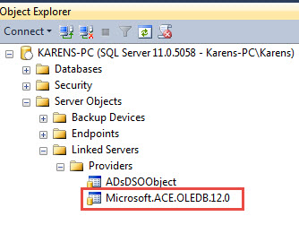
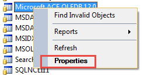
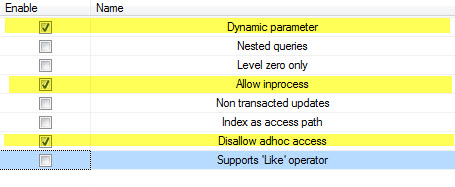

# Information

The objective of this project is to show no matter what the 
operation the base [connection class](https://github.com/karenpayneoregon/BaseConnectionsVisualBasicNet/blob/master/BaseConnectionLibrary/ConnectionClasses/SqlServerConnection.vb) coupled with 
the [base exception](http://example.com) class works no different than a simple data operation.

For this project to run properly follow the instructions.

This article will demonstrate how to export a table within SQL-Server database to Microsoft Excel, 
 utilizing Transact-SQL [OPENROWSET](https://docs.microsoft.com/en-us/sql/t-sql/functions/openrowset-transact-sql?view=sql-server-2017). Using this method means 
no dealing with reading table data from a database into a client container such as a DataTable as 
an intermediate step to saving the table data to Microsoft Excel file where the intermediate step 
can be simple or complex dependent on the chosen logic which could be Excel automation, a third party 
library or using a StreamWriter. What follows are static code samples and dynamic code samples to build upon for your solution.

All base code resides in a class project while execution is performed in a windows form project. 
This by no means that this code is solely for windows form projects as the code to export data can 
run in any C# project type be it WPF, web solution etc.

Before writing code there is configuration to be performed which should be done in SSMS (SQL-Server Management Studio), otherwise the following error will be raised when executing the 
code presented.

> The requested operation could not be performed because OLE DB provider "Microsoft.ACE.OLEDB.12.0" for linked server "(null)" does not support the required transaction interface.

Open SSMS, open Object Explorer, open to the following tree node. 

Right click on the node above and select properties.

Select and check the following properties.

Select the Database node, right click, select Refresh for validation. 
This concludes setting up SQL-Server for exporting data from tables 
in databases.

**Note**
See the following [MSDN code sample](https://code.msdn.microsoft.com/SQL-Server-export-to-Excel-c3c6f21f) for more exports.