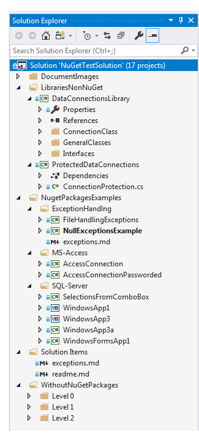

# Working with database connections and exceptions.

This repository is for a Microsoft TechNet article/code sample where the main purpose is to show VB.NET and C# developers a more elegant way to connect to databases and how to better handle runtime exception.

## Project names
Project names are very generic but when viewed in Solution Explorer within Visual Studio these 
projects are setup in several Solution folders which allows easiy identification for what each project is for.

|Project | Description
| :------------- |:-------------|
|**SQL-Server**| Working with server based databases|
|WorkingWithDatabaseOldSchool  | This project shows how many novice developer read data coded within a Windows form rather than in a data class. |
|WorkingWithDatabaseWithSingletonExample  | Uses a singleton pattern, increases complexity and wasteful with resources.  |
|WorkingWithDatabasePartiallyOOP  |First attempt access data using a data class rather than in a form.|
|BestPracticeSqlServer1  | Next step from above project using interfaces       |
|BestPracticeSqlServer2  | Here data connection are done in a class project access in a data class called from a form. |
|SelectionsFromComboBox | Example for working with selecting an item from a ComboBox using NuGet package BaseConnectionLibrary|
|**Class libraries**| Class project usable in Windows forms project|
|DataConnectionsLibrary  | Solely responsoble for creating connection string for SQL-Server, MS-Access and Oracle |
|ProtectedDataConnections  | Provides encrypt and decryption for connection string  |
|**NuGet packages**| Projects using NuGet packages|
|[BaseConnection package](https://www.nuget.org/packages/BaseConnectionLibrary/)|Contains classes for connecting to SQL-Server , Oracle and OleDb compatible databases|
|[DataProviderCommandHelpers](https://www.nuget.org/packages/DataProviderCommandHelpers/)|Contains a language extension method to reveal a parameterized SQL statement|
|FileHandlingExceptions  | Example using a base exception class to handle file IO runtime exceptions. |
|NullExceptionsExample  | Example using a base exception class to handle Null exceptions and other common runtime exceptions  |
|**MS-Access**| Working with Microsoft Access 2007+ databases|
|AccessConnection | Example using a base connection package to open MS-Access without database password  |
|AccessConnectionPassworded | Example using a base connection package to open MS-Access with database password   |
|**Misc**| |
|WindowsApp3a  | Example using a base connection package to open SQL-Server database |
|WindowsFormsApp1  | Multiple NuGet packages to check if SQL-Server serice is running   |
|WindowsApp3 | Shows exporting SQL-Server data to Excel (this one is VB.NET)    |
|WindowsApp3a  | Shows exporting SQL-Server data to Excel (this one is C#)    |

### NuGet packages
The folowing packages will be introduced in the Microsoft TechNet article.

[BaseConnectionLibrary](https://www.nuget.org/packages/BaseConnectionLibrary/)

This package contains classes for connecting to SQL-Server and OleDb compatible databases using managed data providers for VB.NET programming language.

**Package manager**
> Install-Package BaseConnectionLibrary -Version 1.0.0

Classes in this package are designed to work with the following databases.
- SQL-Server
- MS-Access
- Oracle
___

[DataProviderCommandHelpers](https://www.nuget.org/packages/DataProviderCommandHelpers/1.0.0#)

This package contains a language extension method to reveal a parameterized SQL statement written using a managed data provider in C# or VB.NET programming languages.

**Package manager**
> Install-Package DataProviderCommandHelpers -Version 1.0.0

___

#### Code samples
Examples are done in a conventual manner writing data access code directly in a form then move on to writing data access in data classes in two flavors.

For **VB.NET** developers see the following [GitHub repository](https://github.com/karenpayneoregon/NuGetBaseConnectionHowToVB).

**Requires for code samples**
- Microsoft SQL-Server installed.